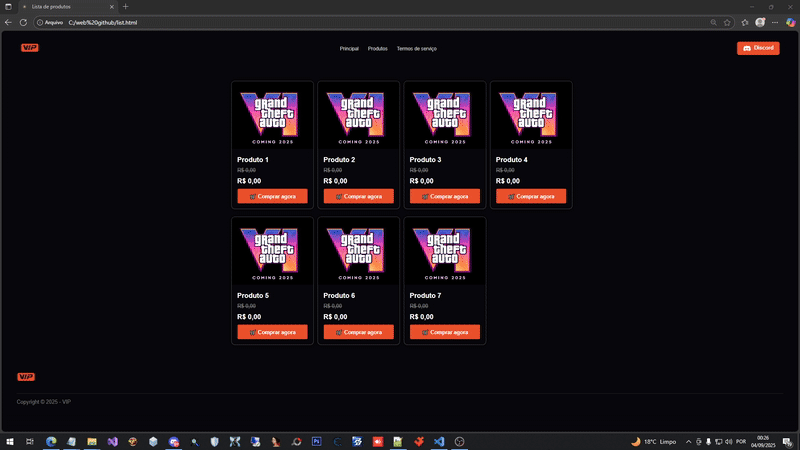

# Listagem de Produtos

Este projeto é uma loja de produtos digitais de jogos, construída de forma dinâmica e escalável. 
Cada produto é gerado automaticamente com JavaScript, evitando a repetição de código e facilitando a manutenção. 
Ao clicar em qualquer item, você pode visualizar os detalhes do produto sem precisar criar várias páginas HTML, tornando a experiência mais fluida e moderna.

Foi pensado para demonstrar boas práticas de front-end, com um design limpo, responsivo e intuitivo, além de mostrar como integrar HTML, CSS e JS de forma eficiente.
Você pode usar a mesma logica para a parte do pagamento ao clicar em Comprar agora.

## Demonstração

